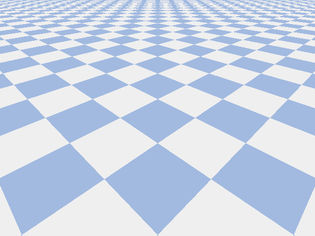
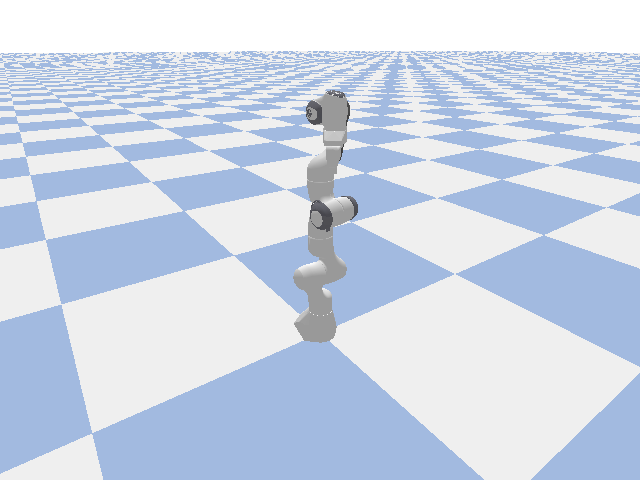
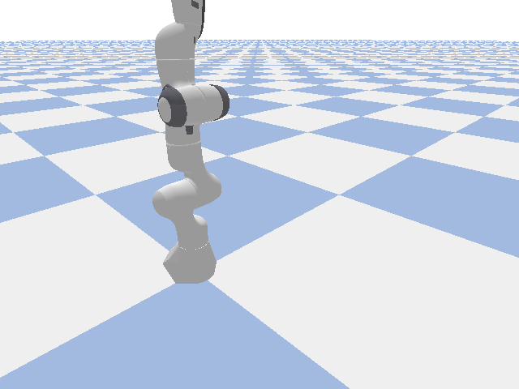
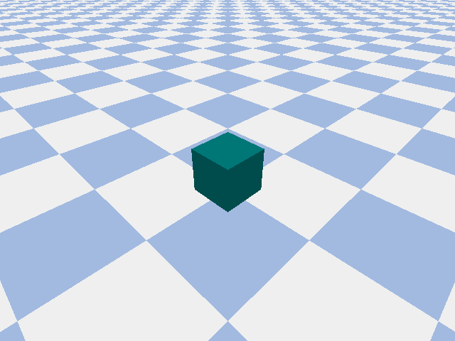
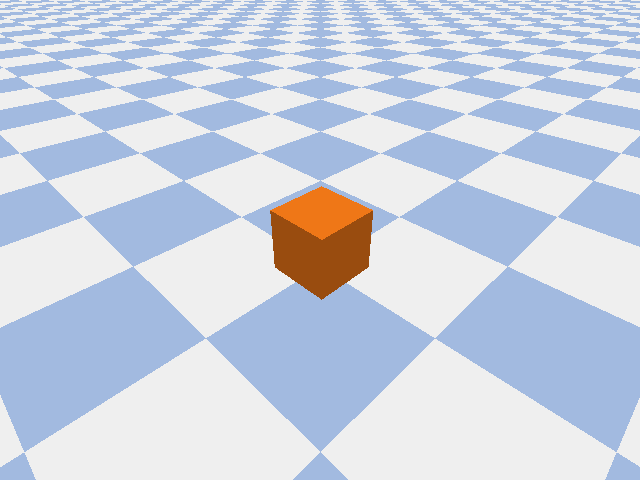
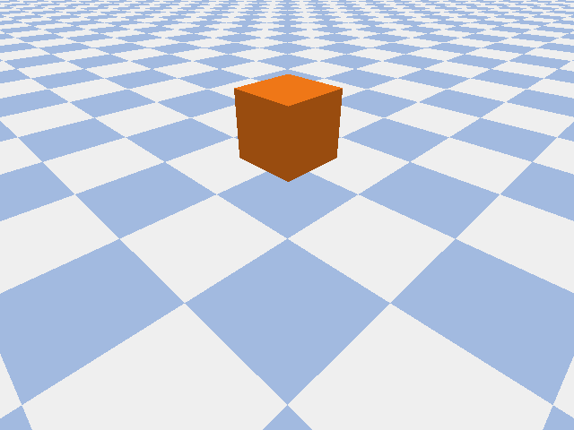
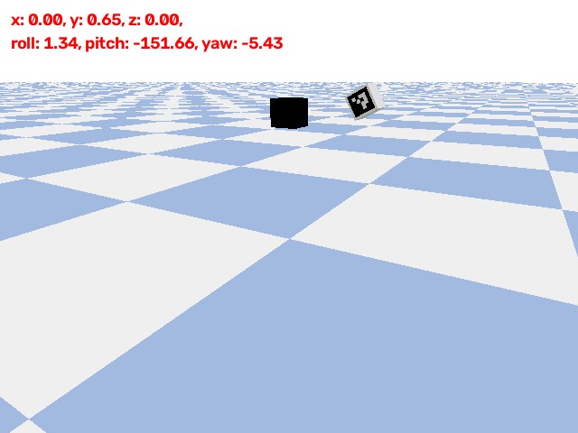

# Simulation Robotics

PyBullet physics demos for robot and rigid-body simulation. Scripts live in `robots/` and are meant to be run with the **`robots` conda environment**, which already includes PyBullet, OpenCV, and NumPy.

## Setup

```bash
conda activate robots
cd simulationRobotics
```

## Demos

| Script                                               | Description                                                               | Run                              |
| ---------------------------------------------------- | ------------------------------------------------------------------------- | -------------------------------- |
| [`robots/hello_world.py`](robots/hello_world.py)     | Connect to PyBullet, load a ground plane and R2-D2, print connection info | `python robots/hello_world.py`   |
| [`robots/robot_arm.py`](robots/robot_arm.py)         | Load a Franka Panda arm and randomly move joints 2 and 4                  | `python robots/robot_arm.py`     |
| [`robots/robot_fingers.py`](robots/robot_fingers.py) | Smooth interpolated motion of joint 4; tracks finger link position        | `python robots/robot_fingers.py` |
| [`robots/cube_creating.py`](robots/cube_creating.py) | Create a 0.5 m box from collision/visual shapes (no URDF)                 | `python robots/cube_creating.py` |
| [`robots/cube_sliding.py`](robots/cube_sliding.py)   | Push a cube horizontally with initial velocity and external force         | `python robots/cube_sliding.py`  |
| [`robots/cube_rolling.py`](robots/cube_rolling.py)   | Launch a cube with diagonal velocity so it tumbles across the plane       | `python robots/cube_rolling.py`  |
| [`robots/aruco_markers.py`](robots/aruco_markers.py) | Fixed simulated camera; ArUco detection and 6-DOF pose (OpenCV `solvePnP`) | `python robots/aruco_markers.py` |

Press `Ctrl+C` to stop any demo that runs a simulation loop.

## Simulation previews

Lightweight GIF previews live in [`docs/previews/`](docs/previews/) so they render inline on GitHub. Regenerate them with:

```bash
conda activate robots
python scripts/record_simulations.py
```

Record a single demo:

```bash
python scripts/record_simulations.py --only cube_sliding
```

### hello_world



R2-D2 spawned above the ground plane with gravity enabled.

### robot_arm



Franka Panda joints 2 and 4 receive random position targets.

### robot_fingers



Joint 4 moves smoothly between random targets while the camera stays focused on the arm.

### cube_creating



A teal 0.5 m cube created programmatically with `createCollisionShape` / `createMultiBody`.

### cube_sliding



Orange cube given forward velocity and a short horizontal push.

### cube_rolling



Cube launched with diagonal velocity and pushed so it tumbles.

### aruco_markers



Simulated camera watches a textured ArUco marker; sliders move the tag while detection runs at 30 Hz and reports pose in the window.

## Project layout

```text
simulationRobotics/
├── README.md
├── docs/
│   └── previews/        # lightweight GIF previews for GitHub
├── robots/
│   ├── hello_world.py
│   ├── robot_arm.py
│   ├── robot_fingers.py
│   ├── cube_creating.py
│   ├── cube_sliding.py
│   ├── cube_rolling.py
│   └── aruco_markers.py
├── URDFS/               # simple_camera, ar_marker_box, robot models
└── scripts/
    └── record_simulations.py
```

## Notes

- All interactive demos use `p.connect(p.GUI)` and open a PyBullet window.
- `scripts/record_simulations.py` uses `p.connect(p.DIRECT)` for headless capture, so you can batch-generate previews without a display.
- PyBullet data assets (`plane.urdf`, `cube.urdf`, `franka_panda/panda.urdf`, etc.) come from the `pybullet_data` package bundled with PyBullet.
